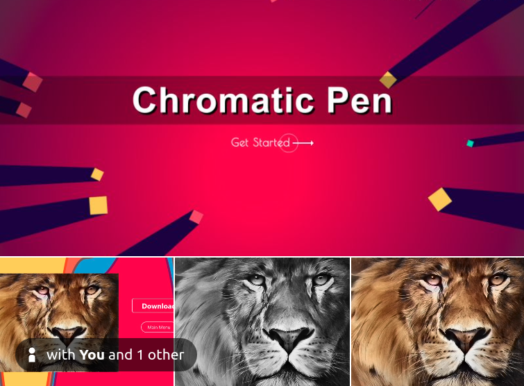

**Description**  
----------------------------------------------------

I developed a desktop application using Python, named "Chromatic Pen," that can effortlessly fill colors into grayscale images, including pencil sketches. This innovative application leverages advanced algorithms to bring life to monochrome images, transforming them into vibrant, colorful artworks. With a user-friendly interface, "Chromatic Pen" allows users to enhance their grayscale images with just a few clicks, making it a powerful tool for artists, designers, and anyone interested in digital coloring.

**Instructions**  
----------------------------------------------------

1. **Download and Extract the Repository**  
   Begin by downloading the repository containing all the necessary files for "Chromatic Pen."

2. **Extract Model Files**  
   Navigate to the “Chromatic-Pen/static/model” folder. Locate the “model.zip.001” file and use 7-zip to extract its contents. This step ensures that all the model files are correctly set up for the application.

3. **Extract Main Application Files**  
   Go to the “Chromatic-Pen” folder. Find the “main.zip.001” file and extract it using 7-zip. This will unpack the main application files needed to run "Chromatic Pen."

4. **Execute the Application**  
   Finally, run the “main.exe” file. This will launch the "Chromatic Pen" application, ready for use in colorizing your grayscale images and pencil sketches.

By following these detailed instructions, you will be able to set up and use "Chromatic Pen" efficiently, unlocking the full potential of this innovative desktop application.
